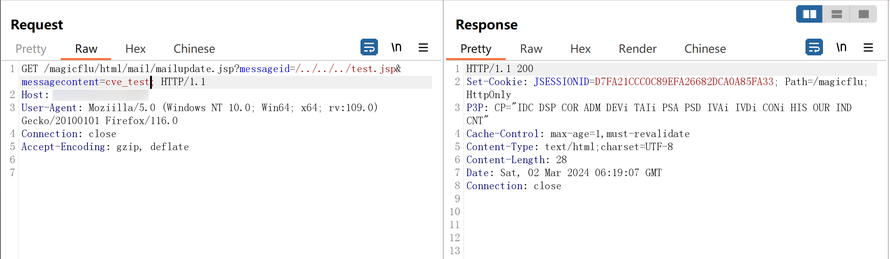
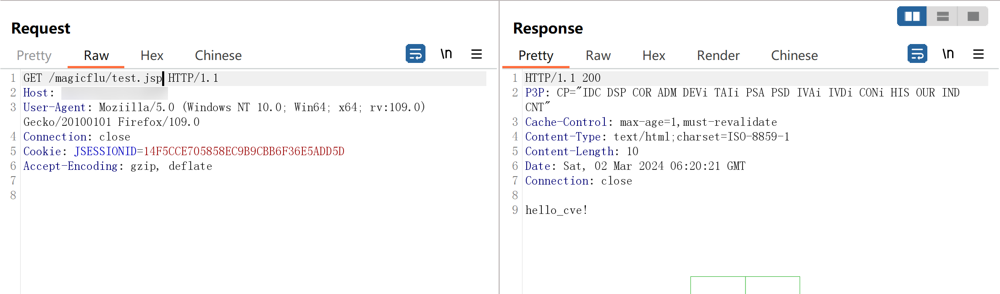

**CVE Request**

**Title:**
magicflu-mailupdate-jsp-fileupload

**NAME OF AFFECTED PRODUCT(S):**
Magicflue

**Description:**
File Upload vulnerability in magicflue v.7.0 and before allows a remote attacker to execute arbitrary code via a crafted request to the messageid parameter of the mail/mailupdate.jsp endpoint.

**Vendor Contact:**
https://www.magicflu.com/

**Affected Versions:**
magicflue v.7.0 and before

**Mitigations:**
Wait for the vendor to fix it

**References:**
Code audits

**Proof of Concept (PoC):**
[magicflu-mailupdate-jsp-fileupload.yaml](magicflu-mailupdate-jsp-fileupload.yaml)

**Verification process:**

1. Home:

2. Upload File:

3. Validation:
